# NextTimeTogether — 종합 기술 분석 문서

> **목적**: 본 문서는 `NextTimeTogether-Frontend` 코드베이스 전반을 구조 / 설계 / 기술 / 로직 / 보안 관점에서 심층 분석하여 정리한 리포트이다. 본문(**PART 1 ~ 6**)은 실측(實測) 기반 코드 리딩 리포트이고, 마지막(**PART 7 — 포트폴리오**)은 포트폴리오 관점에서 프로젝트를 어필하기 위한 섹션이다.

---

## 목차

- [PART 1. 프로젝트 개요](#part-1-프로젝트-개요)
- [PART 2. 시스템 아키텍처](#part-2-시스템-아키텍처)
- [PART 3. 디렉터리 & 모듈 구조](#part-3-디렉터리--모듈-구조)
- [PART 4. 핵심 로직 딥다이브](#part-4-핵심-로직-딥다이브)
  - [4-1. E2EE 클라이언트 사이드 암호화 파이프라인](#4-1-e2ee-클라이언트-사이드-암호화-파이프라인)
  - [4-2. Silent Token Refresh (BFF 패턴)](#4-2-silent-token-refresh-bff-패턴)
  - [4-3. 3단계 E2EE 그룹 조회 플로우](#4-3-3단계-e2ee-그룹-조회-플로우)
  - [4-4. Smart Polling 기반 실시간 시간 조율](#4-4-smart-polling-기반-실시간-시간-조율)
  - [4-5. Pointer Events 기반 드래그 시간 그리드](#4-5-pointer-events-기반-드래그-시간-그리드)
  - [4-6. Pseudo ID & Lookup ID 익명화](#4-6-pseudo-id--lookup-id-익명화)
- [PART 5. 보안 설계 종합](#part-5-보안-설계-종합)
- [PART 6. 데이터 플로우 & 주요 시퀀스](#part-6-데이터-플로우--주요-시퀀스)
- [PART 7. 포트폴리오 — 어필 포인트](#part-7-포트폴리오--어필-포인트)

---

## PART 1. 프로젝트 개요

### 1.1. 한 줄 요약

> **그룹 모임의 "시간 조율 ▸ 장소 선정 ▸ 일정 확정"을 하나의 흐름으로 엮은, 클라이언트 사이드 E2EE 구조의 모바일 우선 웹 애플리케이션**

### 1.2. 제품 성격

| 속성 | 값 |
|---|---|
| 타깃 플랫폼 | **모바일 웹(PWA 스타일)** — `BottomNav` 기반 모바일 레이아웃 |
| 서비스 모드 | B2C — 이메일/SNS 회원가입 기반 개인 계정 |
| 핵심 가치 | 개인정보 최소 노출 + 서버 사이드 추론 방지 + 모바일 친화 드래그 UX |
| 차별화 포인트 | **When2Meet 그리드 + AI 장소 추천 + E2EE 전체 구조** |

### 1.3. 기술 스택 (`package.json` 근거)

| 계층 | 라이브러리 | 버전 | 비고 |
|---|---|---|---|
| **런타임** | `next` | 16 | App Router, Server Actions |
| | `react` / `react-dom` | 19 | |
| | `typescript` | 5.9 | `strict: true` |
| **스타일** | `tailwindcss` | 4 | v4 새 엔진 (`@tailwindcss/postcss`) |
| | `class-variance-authority` | 0.7 | Shadcn variant 패턴 |
| | `lucide-react` / `@svgr/webpack` | - | 아이콘 시스템 |
| **상태** | `zustand` | 5 | 전역 클라이언트 상태 |
| | `@tanstack/react-query` | 5.90 | 서버 상태 + Smart Polling |
| **폼** | `react-hook-form` + `@hookform/resolvers` + `zod` | - | 런타임 스키마 검증 |
| **HTTP** | `axios` | 1.12 | `securityWorker` 기반 토큰 주입 |
| **캘린더** | `@fullcalendar/react` (`daygrid`, `interaction`) | 6.1 | |
| **보안** | `argon2`, `argon2-browser` | - | Node/브라우저 양쪽 지원 |
| | Web Crypto API (`crypto.subtle`) | 브라우저 표준 | PBKDF2 / AES-GCM / HMAC-SHA256 |
| | `@upstash/redis` | 1.35 | (선택) 세션 저장소 |
| **미디어** | `cloudinary`, `next-cloudinary` | - | 이미지 업로드 |
| **DX** | `swagger-typescript-api` | 13.2 | OpenAPI → TS 타입 자동 생성 |

### 1.4. 통계 (실측)

| 지표 | 값 |
|---|---|
| 소스 `.ts`/`.tsx` 파일 수 (generated 제외) | **187개** |
| 페이지 라우트 depth | 최대 **8단계** (`/groups/detail/[groupId]/schedules/detail/[promiseId]/...`) |
| Zod 스키마 | 2종 (`signupSchema.ts`, `scheduleSchemas.ts`) |
| Next Route Handler | 2종 (`/api/search`, `/api/upload`) |
| Server Action | 다수 (login, refresh, register, groups ...) |

---

## PART 2. 시스템 아키텍처

### 2.1. 전체 시스템 조감도

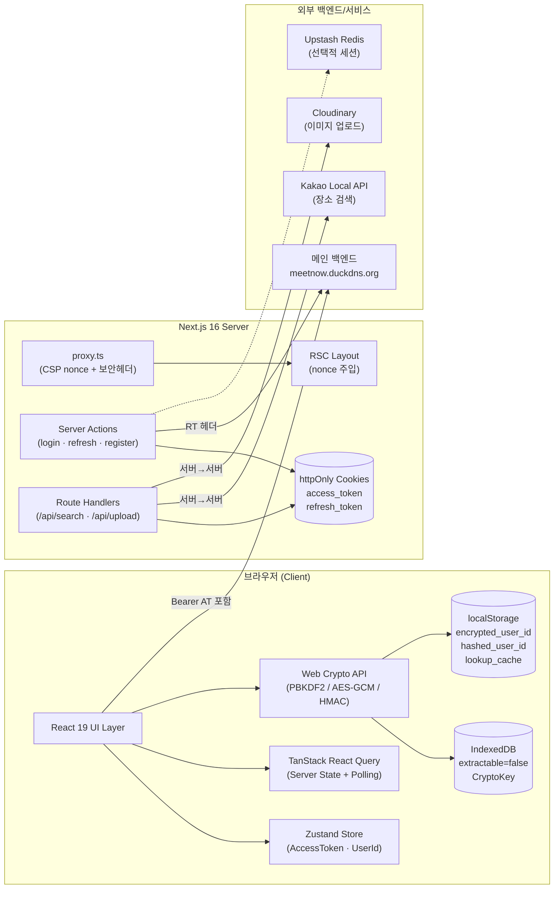

### 2.2. 3-Tier 관점 분리

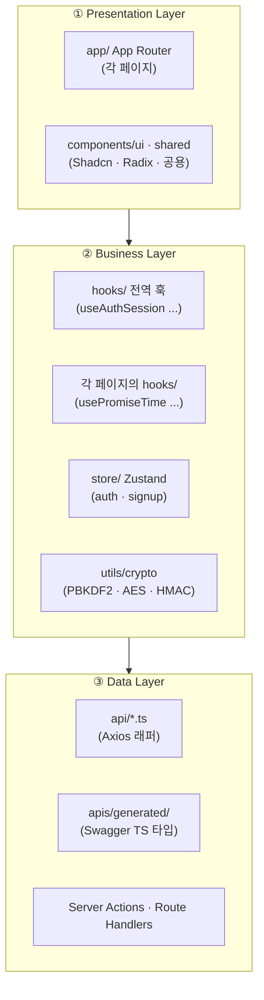

### 2.3. 렌더링 모델

- **App Router**: `app/(auth)/...` · `app/(dashboard)/...` 라우트 그룹으로 **레이아웃 스코프 분리**.
- **Providers**: `Providers` 컴포넌트는 **Client Component**로 `QueryClientProvider`, `Toaster`, `useAuthSession` 호출.
- **RSC ↔ Client 경계**: 대부분의 페이지는 `"use client"`(모바일 인터랙션 중심). 인증 관련 민감 작업만 `"use server"` Server Action으로 분리.

---

## PART 3. 디렉터리 & 모듈 구조

### 3.1. 루트

```
NextTimeTogether-Frontend/
├── src/
│   ├── proxy.ts              ← CSP nonce & 보안 헤더 (이름은 "미들웨어" 역할)
│   ├── app/                  ← Next.js App Router
│   ├── api/                  ← Axios 기반 API 래퍼
│   ├── apis/generated/       ← Swagger 자동 생성 TS 타입
│   ├── components/{ui,shared}
│   ├── hooks/                ← 전역 훅
│   ├── store/                ← Zustand 스토어 (auth · signup)
│   ├── lib/                  ← 토큰 쿠키 · 스키마 · 서버 유틸
│   ├── utils/
│   │   ├── crypto/           ← PBKDF2 · HMAC (서버/브라우저 공용)
│   │   ├── client/crypto/    ← 브라우저 전용 AES-GCM + IV 결합
│   │   └── client/key-storage.ts  ← IndexedDB extractable=false 저장
│   ├── assets/{pngs,svgs}
│   └── types/
├── next.config.ts             ← SVGR webpack 규칙
├── tsconfig.json              ← strict · "@/*" 별칭
└── package.json
```

### 3.2. App Router 라우트 트리

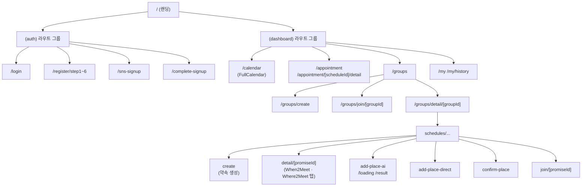

### 3.3. API 레이어의 역할 분담

| 파일 | 사용처 | 특이점 |
|---|---|---|
| `api/index.ts` | **클라이언트 공용** Axios 인스턴스 (`clientBaseApi`) | `securityWorker`가 **Zustand에서 토큰 동기 조회**하여 Authorization 헤더 주입 |
| `api/server-index.ts` | **서버** Axios (`createServerApi`) | `cookies()`에서 httpOnly `access_token` 읽어 헤더 주입 → **RSC/Server Action 전용** |
| `api/auth.ts` | 로그인 · 회원가입 · 로그아웃 | 로그인은 Server Action에서, 회원가입은 axios-direct |
| `api/when2meet.ts` | 시간 게시판 · 내 시간표 · 특정 슬롯 조회 · 확정 | `BackendResponse<T>` 어댑터로 스웨거 불일치 흡수 |
| `api/where2meet.ts` | 장소 게시판 · AI 추천 · 투표 · 확정 | AI 추천은 `UserAIInfoReqDTO`(pseudoId 포함) |
| `api/group-view-create.ts` | **3단계 E2EE 조회** (view1/2/3) + 생성 (create1/2) | 모두 서버 API 래퍼 (SSR에서 토큰 주입) |
| `api/promise-*.ts` | 약속 뷰·생성·초대·키 조회 | `lookupId/lookupVersion` 신규 · `encUserId`는 레거시 이중 요청 |

---

## PART 4. 핵심 로직 딥다이브

### 4-1. E2EE 클라이언트 사이드 암호화 파이프라인

> **핵심 아이디어**: ID · PW · 이메일 · 전화번호 어느 것도 **평문으로 네트워크에 실리지 않는다**. 서버는 증명 해시만 안다.

#### 단계별 구조

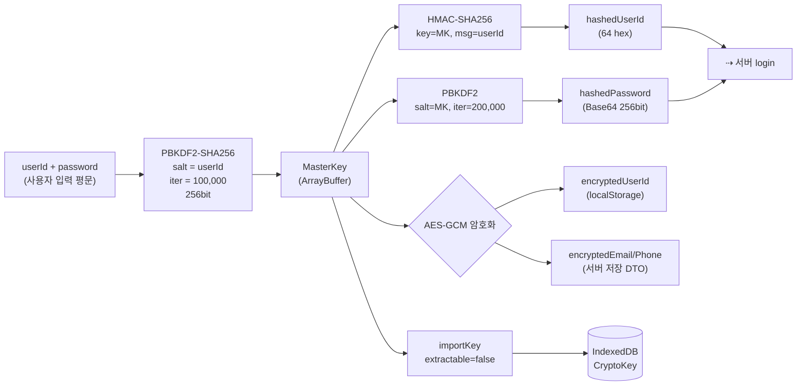

#### 코드 A — MasterKey 파생 (`src/utils/crypto/generate-key/derive-masterkey.ts`)

```typescript
export async function deriveMasterKeyPBKDF2(
  userId: string,
  password: string
): Promise<ArrayBuffer> {
  const encoder = new TextEncoder();
  const salt = encoder.encode(userId);           // ← userId를 salt로 사용 (유저별 유니크)

  const keyMaterial = await crypto.subtle.importKey(
    "raw",
    encoder.encode(password),
    { name: "PBKDF2" },
    false,                                       // ← extractable=false
    ["deriveBits"]
  );

  const derivedBits = await crypto.subtle.deriveBits(
    { name: "PBKDF2", salt, iterations: 100_000, hash: "SHA-256" },
    keyMaterial,
    256
  );
  return derivedBits;                            // 이후 HMAC key / AES key의 원료로만 사용
}
```

> **관전 포인트**
> - `iterations: 100_000` — OWASP 2023 PBKDF2-SHA256 권장치(≥ 600,000)엔 못 미치지만, 인증용 해시는 **200,000**(2배)로 차등화해 **key-reuse 방지**를 위한 도메인 분리를 시도함.
> - salt = userId 전략은 서버에서 salt를 모르는 형태로 **동일 비번 유저의 구별**이 가능하게 함 (서버-unknown-salt).

#### 코드 B — 인증용 해시 2종 (`src/utils/client/crypto/encrypt-password.ts`, `src/utils/crypto/auth/encrypt-id-img.ts`)

```typescript
// 1) Password → 서버 인증용 증명 (PBKDF2 200k iter, key=masterKey 재파생)
export const hashPassword = async (password: string, saltKey: ArrayBuffer) => {
  const baseKey = await crypto.subtle.importKey(
    "raw", new TextEncoder().encode(password), "PBKDF2", false, ["deriveBits"]
  );
  const derivedBits = await crypto.subtle.deriveBits(
    { name: "PBKDF2", salt: saltKey, iterations: 200_000, hash: "SHA-256" },
    baseKey, 256
  );
  return arrayBufferToBase64(derivedBits);
};

// 2) UserId → HMAC-SHA256-256 (고정 64 hex 문자 = 서버 조회 가능한 익명 식별자)
export async function hmacSha256Truncated(
  key: ArrayBuffer | string, keyword: string, bits: number = 256
): Promise<string> {
  const cryptoKey = await crypto.subtle.importKey(
    "raw",
    typeof key === "string" ? new TextEncoder().encode(key) : key,
    { name: "HMAC", hash: "SHA-256" }, false, ["sign"]
  );
  const signature = await crypto.subtle.sign("HMAC", cryptoKey, new TextEncoder().encode(keyword));
  const fullBytes = new Uint8Array(signature).slice(0, bits / 8);
  return Array.from(fullBytes).map(b => b.toString(16).padStart(2, "0")).join("");
}
```

#### 코드 C — 추출 불가 CryptoKey 저장 (`src/utils/client/key-storage.ts`)

```typescript
export async function storeMasterKey(masterKey: ArrayBuffer): Promise<void> {
  const cryptoKey = await crypto.subtle.importKey(
    "raw",
    masterKey,
    { name: "AES-GCM" },
    false,                          // ★ extractable=false — JS로 키 값 추출 불가
    ["encrypt", "decrypt"]
  );
  const db = await openKeyStoreDB();                 // IndexedDB 'E2EEKeyStore'
  const tx = db.transaction(STORE_NAME, "readwrite");
  const store = tx.objectStore(STORE_NAME);
  await new Promise<void>((resolve, reject) => {
    const req = store.put(cryptoKey, KEY_ID);        // put(CryptoKey 자체, 'userMasterKey')
    req.onsuccess = () => resolve();
    req.onerror = () => reject(req.error);
  });
}
```

> **관전 포인트**: `extractable=false`인 CryptoKey는 **JS 어떤 코드로도 raw 바이트를 꺼낼 수 없다**. 즉 XSS가 성공해도 공격자가 얻을 수 있는 것은 **키 핸들**뿐이고, 그것도 같은 Origin의 해당 세션 탭에서만 유효하다.

#### 코드 D — AES-GCM + 랜덤 IV 12B 결합 (`src/utils/client/crypto/crypto-storage.ts`)

```typescript
export async function encryptStringToBase64(data: string, key: CryptoKey): Promise<string> {
  const iv = crypto.getRandomValues(new Uint8Array(12));       // ★ 매번 새 IV
  const cipher = await crypto.subtle.encrypt(
    { name: "AES-GCM", iv }, key, new TextEncoder().encode(data)
  );
  // 저장 포맷: [IV(12B) || ciphertext(+tag 16B)] → Base64
  const combined = new Uint8Array(iv.length + cipher.byteLength);
  combined.set(iv, 0);
  combined.set(new Uint8Array(cipher), iv.length);
  return arrayBufferToBase64(combined.buffer);
}
```

> **관전 포인트**: AES-GCM의 `IV 재사용은 치명적 취약`이므로 매번 `getRandomValues`로 생성. 복호화 측에서 동일 포맷(앞 12바이트 IV) 가정으로 분리.

---

### 4-2. Silent Token Refresh (BFF 패턴)

#### 토큰 저장 매트릭스

| 저장소 | 이름 | JS 접근 | 서버 SSR 접근 | 공격면 |
|---|---|:---:|:---:|---|
| Zustand (메모리) | `accessToken` | ✅ | ❌ | XSS로 훔치려면 런타임 접근 필요 |
| httpOnly Cookie | `access_token` | ❌ | ✅ | CSRF는 SameSite=lax로 방어 |
| httpOnly Cookie | `refresh_token` | ❌ | ✅ (Server Action만) | 유일 소스 — 탈취되면 새 AT 발급 가능 |
| IndexedDB | `userMasterKey` (extractable=false) | ❌ (raw) | ❌ | JS는 "사용"만 가능, "추출" 불가 |
| localStorage | `encrypted_user_id`, `hashed_user_id_for_manager`, `pseudo_id_index_key` | ✅ | ❌ | **복호화 키 없인 의미 없음** |

#### 세션 복원 시퀀스

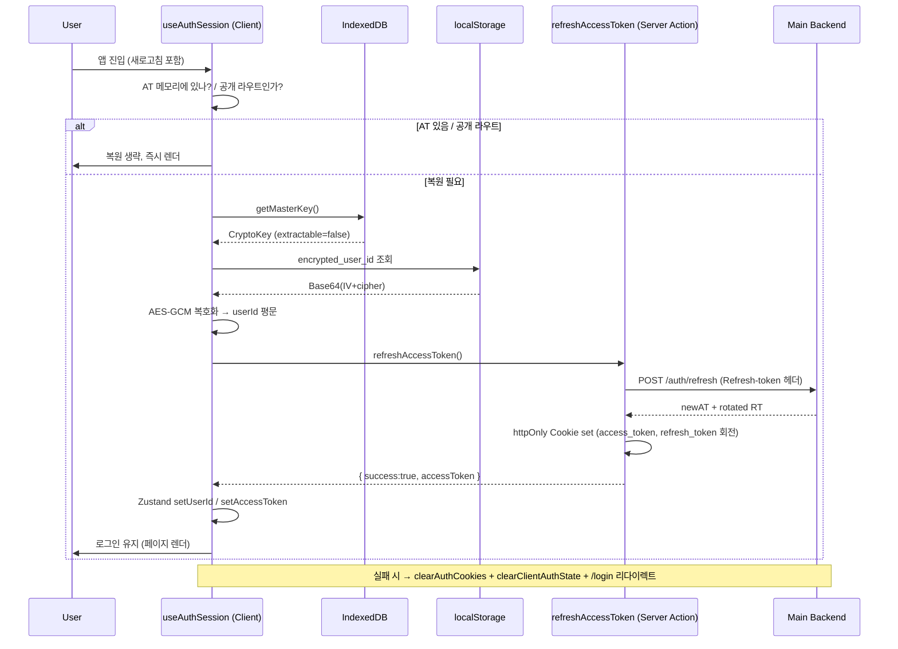

#### 코드 — `src/hooks/useAuthSession.ts` (요약 발췌)

```typescript
export const useAuthSession = () => {
  const { accessToken, setAccessToken, userId, setUserId } = useAuthStore();
  useEffect(() => {
    if ((accessToken && userId) || ["/login", "/"].includes(pathname) || pathname.includes("/register")) {
      setIsRestoring(false); return;                              // 공개 라우트는 복원 생략
    }
    (async () => {
      try {
        const masterKey = await getMasterKey();                   // IndexedDB
        if (!masterKey) throw new Error("no MasterKey");
        const enc = localStorage.getItem("encrypted_user_id");
        if (!enc) throw new Error("no encrypted_user_id");
        const uid = await decryptStringFromBase64(enc, masterKey);// 복호화

        const r = await refreshAccessToken();                     // Server Action (BFF)
        if (!r.success || !r.accessToken) throw new Error(r.error || "refresh failed");

        setUserId(uid);
        setAccessToken(r.accessToken);                            // ✅ 메모리에만
      } catch (err) {
        await clearAuthCookies();                                 // httpOnly 제거 (Server Action)
        clearClientAuthState();                                   // Zustand + localStorage 정리
        if (pathname !== "/login") router.replace("/login");
      } finally { setIsRestoring(false); }
    })();
  }, [/* ... */]);
  return { isRestoring };
};
```

> **관전 포인트**
> - `Providers`가 `isRestoring === true`면 `<DefaultLoading />`을 **대체 렌더**해서 복원 완료 전에 보호 라우트가 그려지는 경쟁 조건을 차단한다.
> - `refreshAccessToken()`은 Server Action이라 클라이언트 번들에 `refresh_token`이 실리지 않음.

---

### 4-3. 3단계 E2EE 그룹 조회 플로우

`useGroupDetail`(`src/app/(dashboard)/groups/detail/[groupId]/hooks/use-group-detail.ts`)은 서버에 "내 그룹이 뭐냐"를 평문으로 물어보지 않는다. 대신 **키·데이터 분리 조회**와 **클라이언트 복호화**를 체이닝한다.

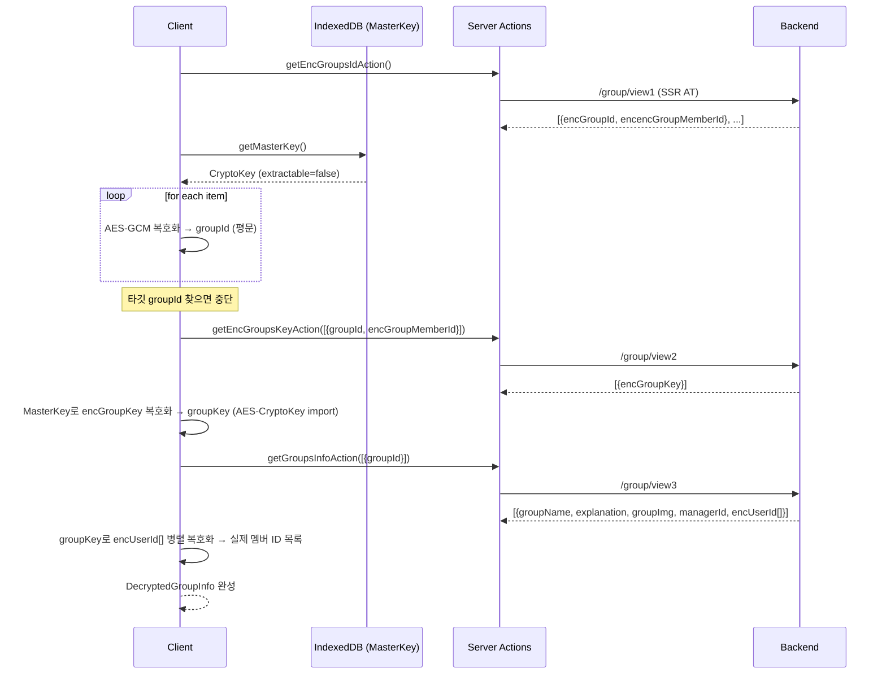

#### 핵심 코드 발췌 (3 steps × `useQuery`)

```typescript
// Step 1: 전체 암호화 groupId 목록 중 타깃만 찾아서 복호화
const { data: groupMetadata } = useQuery({
  queryKey: ["groupDetail", "step1", targetGroupId],
  queryFn: async () => {
    const result = await getEncGroupsIdAction();
    const masterKey = await getMasterKey();
    for (const item of result.data) {
      const decryptedGroupId = await decryptDataClient(item.encGroupId, masterKey, "group_proxy_user");
      if (decryptedGroupId === targetGroupId) {
        const decryptedGroupMemberId = await decryptDataClient(item.encencGroupMemberId, masterKey, "group_proxy_user");
        return { groupId: decryptedGroupId, encGroupMemberId: decryptedGroupMemberId };
      }
    }
    throw new Error("해당 그룹을 찾을 수 없거나 접근 권한이 없습니다.");
  },
  retry: shouldRetry,   // 복호화 실패·권한 에러는 재시도 안 함 (비용 낭비 방지)
});

// Step 2: 개인 마스터키로 래핑된 groupKey 복호화 → AES-CryptoKey로 import
const { data: groupKey } = useQuery({
  queryKey: ["groupDetail", "step2", targetGroupId],
  queryFn: async () => {
    const keyString = await decryptDataClient(res.data[0].encGroupKey, masterKey, "group_sharekey");
    return await crypto.subtle.importKey("raw", base64ToArrayBuffer(keyString),
      { name: "AES-GCM" }, false, ["decrypt", "encrypt"]);
  },
  enabled: !!groupMetadata && !isStep1Error,
});

// Step 3: groupKey로 모든 멤버 userId 병렬 복호화
const { data: finalGroupData } = useQuery({
  queryKey: ["groupDetail", "step3", targetGroupId],
  queryFn: async () => {
    const decryptedMemberIds = await Promise.all(
      targetGroup.encUserId.map(encId => decryptDataClient(encId, groupKey, "group_sharekey"))
    );
    return { groupId, groupName, groupImg, managerId, userIds: decryptedMemberIds };
  },
  enabled: !!groupMetadata && !!groupKey,
});
```

> **관전 포인트**
> - 체인의 모든 단계가 **React Query로 캐시/재시도 독립 제어** → 복호화 실패(`shouldRetry` false)는 네트워크 재시도로부터 분리.
> - `groupKey`가 **AES-CryptoKey 객체로 재import**되어 메모리 안에서만 사용 → localStorage/sessionStorage 절대 저장하지 않음.

---

### 4-4. Smart Polling 기반 실시간 시간 조율

WebSocket 없이 **폴링만으로** 다중 사용자 실시간 조율을 구현하되, 입력 UX를 해치지 않는 "입력 중 폴링 정지" 전략.

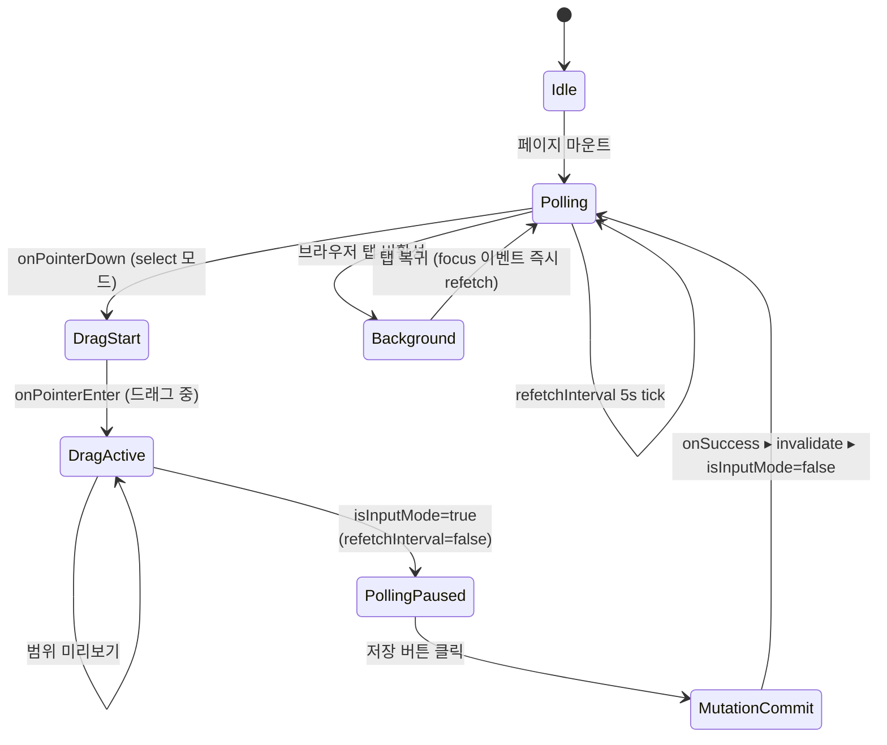

#### 코드 (`src/app/.../when-components/use-promise-time.ts`)

```typescript
export const usePromiseTime = (promiseId: string, isInputMode: boolean = false) => {
  const boardQuery = useQuery<TimeBoardResponse>({
    queryKey: TIME_KEYS.board(promiseId),
    queryFn: () => getPromiseTimeBoard(promiseId),
    refetchInterval: isInputMode ? false : 5000,       // ★ 입력 중엔 폴링 차단
    refetchIntervalInBackground: false,                // 비활성 탭은 서버자원 낭비 X
    refetchOnWindowFocus: true,                        // 탭 복귀 시 즉시 1회
    staleTime: 0,                                      // 폴링·포커스마다 무조건 신선하게
    placeholderData: (prev) => prev,                   // 리페치 동안 이전 데이터 유지(깜빡임 차단)
  });

  const updateMutation = useMutation({
    mutationFn: (data: UserTimeSlotReqDTO) => updateMyTimetable(promiseId, data),
    onSuccess: () => {
      queryClient.invalidateQueries({ queryKey: TIME_KEYS.board(promiseId) });
      toast.success("시간표가 저장되었습니다!");
    },
  });

  return { boardQuery, updateMutation, confirmMutation };
};
```

#### 부모 컴포넌트(`When2Meet.tsx`)에서의 스위치

```typescript
const [isInputMode, setIsInputMode] = useState(false);
const { boardQuery, updateMutation } = usePromiseTime(promiseId, isInputMode);
// ...
<TimeTableGrid
  mode="select"
  onDragStart={() => setIsInputMode(true)}   // 드래그 시작 → 폴링 OFF
  onDragEnd={() => setIsInputMode(false)}    // 드래그 끝 → 5s 뒤 폴링 ON
/>
```

> **관전 포인트**: 일반적인 폴링 구현은 "입력 중에도 화면이 점멸"하는 UX 문제가 생긴다. 이 프로젝트는 **UI 상태(isInputMode)를 쿼리 파라미터로 승격**시켜 React Query에 제어권을 위임했다. **장소 투표**(`use-place-board.ts`)는 충돌 위험이 적어 3초로 더 공격적이다.

---

### 4-5. Pointer Events 기반 드래그 시간 그리드

`TimeTableGrid.tsx`는 When2Meet의 핵심 UX 컴포넌트로, **7일 × 30개 (9:00~24:00, 30분 단위)** 셀 매트릭스를 Pointer Events 단일 API로 통합 처리한다.

#### 상태 머신

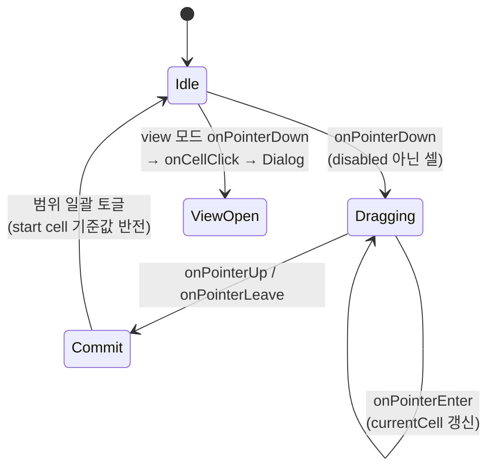

#### 코드 요점

```typescript
// 드래그 시작
const handlePointerDown = (day, time, e) => {
  e.stopPropagation();                                   // Dialog 이벤트 전파 차단
  if (mode === "view") { onCellClick?.(day, time); return; }
  if (disabledSlots?.[day]?.[time]) return;              // 내 기존 일정 회색 셀은 선택 불가
  e.preventDefault();                                    // 터치 스크롤 충돌 방지
  setIsDragging(true);
  onDragStart?.();                                       // 부모 isInputMode=true → 폴링 정지
  setStartCell({ day, time });
  setCurrentCell({ day, time });
};

// 드래그 종료 시 범위 일괄 토글 (시작 셀의 반대값으로 범위 전체 세팅)
const handlePointerUp = () => {
  if (isDragging) onDragEnd?.();
  if (mode !== "select" || !isDragging || !startCell || !currentCell) {
    setIsDragging(false); return;
  }
  const newSelection = internalSelection.map(r => [...r]);
  const newValue = !internalSelection[startCell.day][startCell.time];
  for (let d = Math.min(startCell.day, currentCell.day); d <= Math.max(startCell.day, currentCell.day); d++) {
    for (let t = Math.min(startCell.time, currentCell.time); t <= Math.max(startCell.time, currentCell.time); t++) {
      if (disabledSlots?.[d]?.[t]) continue;             // 비활성 셀 스킵
      newSelection[d][t] = newValue;
    }
  }
  setInternalSelection(newSelection);
  onChange?.(newSelection);
  setIsDragging(false);
};

// 셀 스타일 (view 모드 = 히트맵, select 모드 = 드래그 프리뷰)
const getCellStyle = (day, time) => {
  if (mode === "view") {
    const count = data ? data[day][time] : 0;
    const opacity = count === 0 ? 0 : count / maxMembers;
    return { backgroundColor: count === 0 ? "transparent" : `rgba(139, 92, 246, ${opacity})` };
  }
  let isSelected = internalSelection[day][time];
  if (isDragging && startCell && currentCell) {
    const inRange =
      day  >= Math.min(startCell.day, currentCell.day)  && day  <= Math.max(startCell.day, currentCell.day) &&
      time >= Math.min(startCell.time, currentCell.time) && time <= Math.max(startCell.time, currentCell.time);
    if (inRange) isSelected = !internalSelection[startCell.day][startCell.time];
  }
  return { backgroundColor: isSelected ? "#FBBF24" : "transparent" };
};
```

```tsx
// 각 셀에 touchAction: "none" 필수 (iOS Safari 스크롤 충돌 해결)
<div
  style={{ ...getCellStyle(d, t), touchAction: "none" }}
  onPointerDown={(e) => handlePointerDown(d, t, e)}
  onPointerEnter={() => handlePointerEnter(d, t)}
/>
```

> **관전 포인트**
> - `Pointer Events`(W3C) 하나로 mouse/touch/pen을 통합 → mobile-first 프로젝트에 맞는 선택.
> - 히트맵 투명도 = `count / maxMembers` → "가장 많은 사람이 가능한 슬롯"이 시각적으로 즉시 드러남.
> - `convertApiDataToGridFormat` / `convertGridToApiPayload`로 **API ↔ UI 2차원 배열**을 어댑터 패턴으로 양방향 변환.

---

### 4-6. Pseudo ID & Lookup ID 익명화

서버는 진짜 유저 ID(또는 그룹 ID)를 모른 채로도 **인덱싱 가능한 식별자**가 필요하다. 이를 위해 클라이언트가 HMAC으로 파생한 `lookupId`(64-hex)를 서버로 보낸다.

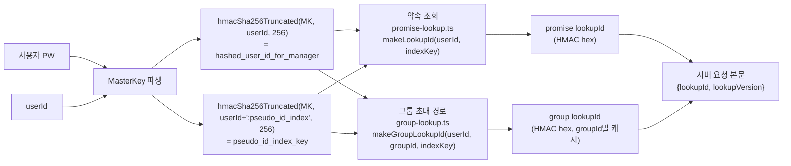

#### 코드 (`src/utils/client/group-lookup.ts`에서)

```typescript
export async function makeGroupLookupId(userId, groupId, indexKey, version = 1): Promise<string> {
  const payload = version === 1
    ? `${userId.toLowerCase().trim()}:${groupId.trim()}`
    : `v${version}:${userId.toLowerCase().trim()}:${groupId.trim()}`;
  return makeHmacSha256Hex(payload, indexKey.trim());   // 64 hex 문자
}

// localStorage 기반 per-user 캐시 + sanitize (잘못된 엔트리는 자동 재작성)
export async function resolveGroupLookupContext(groupId, version = 1) {
  const userId = localStorage.getItem("hashed_user_id_for_manager")!;
  const cache = ensureCacheForUser(userId.toLowerCase());
  const cached = cache.entries[groupId];
  if (cached?.lookupVersion === version) return cached;

  const indexKey = getLookupIndexKeyFromStorage(userId);
  const lookupId = await makeGroupLookupId(userId, groupId, indexKey, version);
  if (!/^[0-9a-f]{64}$/.test(lookupId)) throw new Error("lookupId format invalid.");
  cache.entries[groupId] = { lookupId, lookupVersion: version };
  writeGroupLookupCache(cache);
  return cache.entries[groupId];
}
```

> **관전 포인트**
> - `lookupVersion` 필드는 미래의 HMAC 파생 규칙 변경에 대비한 **파생-알고리즘 버저닝** 장치.
> - `NEXT_PUBLIC_PROMISE_LOOKUP_DUAL_REQUEST` / `NEXT_PUBLIC_GROUP_LOOKUP_ENABLED` 플래그로 **레거시(encUserId) 병행 요청**과 신규 방식 전환을 제어 → 런타임 A/B 전환 가능.

---

## PART 5. 보안 설계 종합

### 5.1. CSP nonce 기반 보안 헤더 파이프라인 (`src/proxy.ts`)

> ⚠️ 파일 이름은 `proxy.ts`지만 역할은 Next.js **미들웨어**. `export const config.matcher`로 `/_next/static` 등을 제외한 모든 요청에 hook된다.

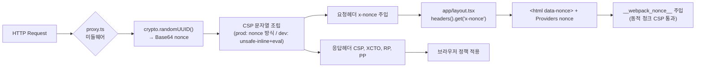

#### 핵심 코드

```typescript
// src/proxy.ts
const nonce = Buffer.from(crypto.randomUUID()).toString("base64");
const scriptSrcPolicy = isDevelopment
  ? `'self' 'unsafe-inline' 'unsafe-eval'`                           // 개발만 허용
  : `'self' 'nonce-${nonce}'`;                                       // 프로덕션은 nonce 전용

const cspHeader = `
  default-src 'self';
  connect-src 'self' ${apiBaseUrl};
  script-src ${scriptSrcPolicy};
  style-src  'self' 'unsafe-inline';                                 // Shadcn · tailwind CSS-in-JS 호환
  img-src    'self' blob: data: https://res.cloudinary.com;
  font-src   'self' data:;
  object-src 'none';
  base-uri   'self';
  form-action 'self';
  frame-ancestors 'none';                                            // 클릭재킹 방지
  frame-src  'self';
  upgrade-insecure-requests;
`.replace(/\s{2,}/g, " ").trim();

requestHeaders.set("x-nonce", nonce);                                // RSC가 읽도록
response.headers.set("Content-Security-Policy", cspValue);
response.headers.set("X-Content-Type-Options", "nosniff");
response.headers.set("Referrer-Policy", "strict-origin-when-cross-origin");
response.headers.set("Permissions-Policy", "camera=(), microphone=(), geolocation=(self)");
```

```tsx
// src/app/layout.tsx + src/app/providers.tsx
const nonce = (await headers()).get("x-nonce") || undefined;
return (
  <html lang="ko" data-nonce={nonce}>
    <body><Providers nonce={nonce}>{children}</Providers></body>
  </html>
);

// Providers.tsx
if (typeof window !== "undefined" && nonce) __webpack_nonce__ = nonce;
```

> **관전 포인트**: Next.js 16 App Router에서 webpack의 dynamic chunk `<script>` 요소가 nonce를 통과하도록 `__webpack_nonce__`를 브라우저 전역에 주입하는 표준 패턴.

### 5.2. 공격 시나리오별 방어선

| 공격 벡터 | 방어 위치 | 메커니즘 |
|---|---|---|
| XSS (inline script injection) | `proxy.ts` | CSP `script-src 'self' 'nonce-...'` — 공격자가 nonce를 알 수 없음 |
| XSS (token 탈취) | `auth.store.ts` / `key-storage.ts` | AccessToken은 메모리(모듈 scope), MasterKey는 `extractable=false` |
| CSRF | `login/action.ts` | `SameSite: "lax"` + httpOnly, Server Action은 origin-bound |
| 클릭재킹 | CSP | `frame-ancestors 'none'` |
| MIME 스니핑 | CSP | `X-Content-Type-Options: nosniff` |
| Referer 누출 | CSP | `Referrer-Policy: strict-origin-when-cross-origin` |
| 과도한 권한 | CSP | `Permissions-Policy: camera=(), microphone=(), geolocation=(self)` |
| SQL/서버측 유저 ID 수집 | 클라이언트 해싱 | HMAC-SHA256-256(hashedUserId)만 전송 → DB에 평문 UID 없음 |
| DB 유출 시 이메일·전화번호 노출 | 클라이언트 AES-GCM | 각 PII 필드마다 랜덤 IV + ciphertext 저장 |
| 세션 고정 | Refresh Token 회전 | `refresh.action.ts`가 `Set-Cookie` 회전 헤더 재설정 |
| 무차별 로그인 | 해싱 비용 | PBKDF2 100k/200k iter + 클라이언트 측 작업 비용 |
| 파일 업로드 남용 | `/api/upload/route.ts` | MIME 화이트리스트 + 5MB 제한 + JWT exp 검증 + refresh 재시도 |
| API 키 노출 | `/api/search/route.ts` | Kakao API 키는 서버(Route Handler)에서만 사용 |

### 5.3. `/api/upload` 인증 재시도 (BFF 강화)

```typescript
// src/app/api/upload/route.ts 요약
const ensureAuthenticated = async () => {
  const at = (await cookies()).get("access_token")?.value;
  if (isValidAccessToken(at)) return true;                  // JWT exp 수동 파싱
  const rt = (await cookies()).get("refresh_token")?.value;
  if (!rt) return false;
  const r = await refreshAccessToken();                     // 1회 자동 재발급
  return r.success && isValidAccessToken(r.accessToken);
};
```

> **관전 포인트**: 일반 클라이언트 요청 흐름과 달리 Route Handler는 Zustand 메모리를 못 쓰므로, **httpOnly 쿠키만으로 자가-인증 + 자가-갱신**을 수행.

---

## PART 6. 데이터 플로우 & 주요 시퀀스

### 6.1. 로그인 전 과정 (E2EE + BFF)

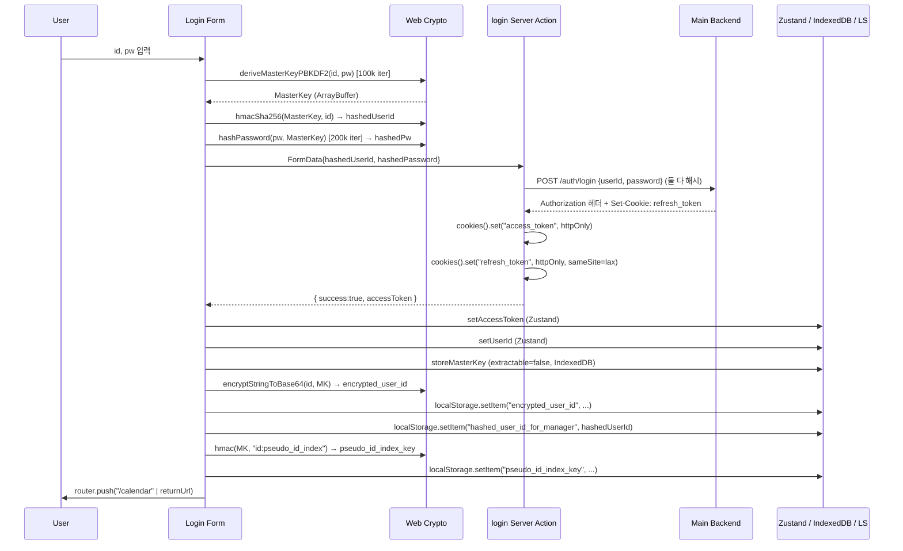

### 6.2. 약속(Promise) 생성 · 조회 · 참여 전체 라이프사이클

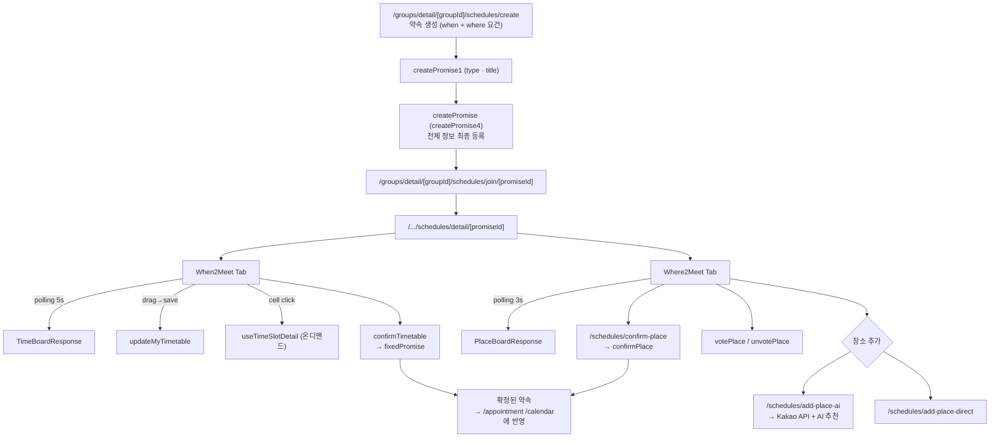

### 6.3. 컴포넌트 ↔ 훅 ↔ API 계층 매핑 (When2Meet 예)

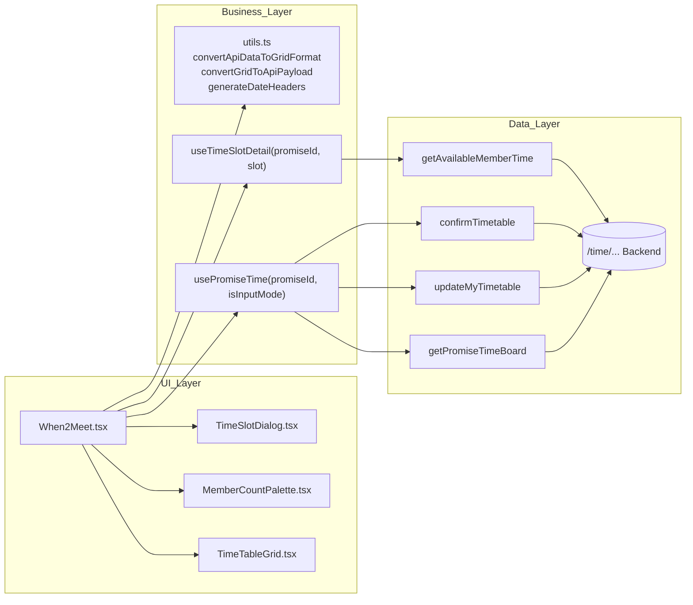

---

## PART 7. 포트폴리오 — 어필 포인트

> **여기서부터는 프로젝트의 임팩트를 "왜 이 결정이 의미 있는가"의 관점으로 재구성한 포트폴리오용 요약입니다.**

### 7.1. 한눈 요약 — "무엇을 만들었나"

- **서비스**: 그룹 모임의 시간 조율(When2Meet) + 장소 선정(Where2Meet) + 확정 캘린더를 하나의 모바일 웹에서 처리하는 **올인원 모임 조율 플랫폼**.
- **규모**: Next.js 16 App Router + React 19, **TypeScript strict**, 187개 모듈, **최대 8단계 동적 라우팅** (`/groups/detail/[groupId]/schedules/detail/[promiseId]/...`).
- **차별화 한 줄**: 보통 프로젝트에서 "보안은 백엔드가 한다"는 전제를 깨고, **프론트엔드가 암호학적 증거만 생산해 서버로 전달**하는 E2EE 구조를 직접 설계·구현했다.

### 7.2. 대표 기술 임팩트 TOP 5

#### ① 브라우저 네이티브 기반 E2EE 인증 시스템 설계

| 항목 | 내용 |
|---|---|
| **문제** | 서버 DB가 유출되더라도 유저의 비밀번호/이메일/전화번호가 복원되지 않아야 한다. |
| **접근** | Web Crypto API (`crypto.subtle`) 하나만 사용하여 PBKDF2(100k iter, salt=userId) 로 MasterKey 파생, HMAC-SHA256 으로 서버 인증용 증거 생성, AES-GCM 으로 PII 암호화. |
| **결정적 설계** | MasterKey를 IndexedDB에 **`extractable: false`** 옵션으로 저장 → XSS가 성공하더라도 공격자는 키를 사용할 수만 있고, **raw 바이트 추출은 브라우저 레벨에서 차단**. |
| **성과** | 서버는 평문 ID/비밀번호를 **영원히 받지 않는다**. 로그에 남을 수도 없다. |

```typescript
// 핵심 한 줄 — 라이브러리 없이 표준 API만으로 "추출 불가" 키 저장
await crypto.subtle.importKey("raw", masterKey, { name: "AES-GCM" }, false, ["encrypt", "decrypt"]);
//                                                                   ↑ extractable=false
```

#### ② Silent Refresh + BFF로 "새로고침해도 로그인 유지"를 구현

| 항목 | 내용 |
|---|---|
| **문제** | AccessToken을 localStorage에 저장하면 XSS 위협, 메모리에만 두면 새로고침 시 로그아웃. |
| **접근** | AT는 **Zustand 메모리 단일 소스** + SSR/BFF 호환용 httpOnly `access_token` 쿠키 복제. RT는 **httpOnly `refresh_token` 쿠키 단일 소스** (JS 접근 원천 차단). 새로고침 시 `useAuthSession` → `refreshAccessToken()` Server Action → AT 재발급. |
| **성과** | 토큰이 **JS 번들 어디에도 하드코딩되지 않고**, 공격자가 `document.cookie`로도 `localStorage`로도 훔칠 수 없다. |

```typescript
// 클라이언트는 RT를 만진 적이 없다 — Server Action 내부에서만 cookie store로 다뤄진다
const refreshToken = (await cookies()).get("refresh_token")?.value; // 서버에서만
```

#### ③ Smart Polling — WebSocket 없이 실시간 UX

| 항목 | 내용 |
|---|---|
| **문제** | 여러 사람이 동시에 가능 시간 체크 → 화면 실시간 갱신 필요. 하지만 드래그 중에 서버 데이터가 들어오면 내 입력이 덮어 씌워진다. |
| **접근** | TanStack Query의 `refetchInterval`을 **입력 상태(`isInputMode`)의 함수로** 동적 제어. 드래그 시작 → `isInputMode=true` → 폴링 정지. 드래그 종료 → 재개. `placeholderData: prev => prev`로 깜빡임 차단. |
| **성과** | WebSocket 인프라 비용 0 + 입력 충돌 0 + 백그라운드 탭에서 자원 절약 (`refetchIntervalInBackground: false`). |

```typescript
refetchInterval: isInputMode ? false : 5000,    // 입력 중엔 폴링 OFF
refetchIntervalInBackground: false,             // 비활성 탭은 요청 안 함
placeholderData: (prev) => prev,                // UI 깜빡임 제거
```

#### ④ Pointer Events 기반 모바일/데스크탑 통합 드래그 그리드

| 항목 | 내용 |
|---|---|
| **문제** | When2Meet은 모바일 터치 드래그가 생명이지만, `mousedown`/`touchstart`를 분기 처리하면 iOS Safari 스크롤 충돌이 빈번. |
| **접근** | W3C **Pointer Events** 단일 API (`onPointerDown/Enter/Up`) + `touchAction: "none"` CSS로 브라우저 레벨 스크롤 제스처 차단. 히트맵은 `rgba(139, 92, 246, count/maxMembers)`로 가능 인원이 많을수록 진해짐. |
| **성과** | 한 번 작성한 드래그 로직이 **마우스·터치·펜**에서 모두 동일 동작. 드래그 범위 토글 방식으로 **직관적 다중 셀 입력**. |

#### ⑤ 3단계 E2EE 그룹 조회 — "복호화 불가능하면 접근 불가능"

| 항목 | 내용 |
|---|---|
| **문제** | 그룹 목록·키·멤버를 서버가 평문으로 주는 순간, 서버 관리자가 소셜그래프를 들여다볼 수 있다. |
| **접근** | 서버는 **"암호화된 ID/Key 꾸러미"만 가짐**. 클라이언트가 MasterKey로 groupId 복호화 → 그룹 키를 다시 복호화 → 해당 키로 멤버 목록 복호화. React Query로 3단계를 독립 캐시, `shouldRetry`로 복호화 에러는 재시도 안 함 (비용 낭비 방지). |
| **성과** | DB가 유출되어도 "누가 어느 그룹에 속했는지"는 **개인 마스터키 없이 복원 불가**. 서버 로그만으로는 소셜그래프 추정이 안 된다. |

### 7.3. 아키텍처 결정 스냅샷

| 결정 | 대안 | 선택 이유 |
|---|---|---|
| **Zustand + React Query 분리** | Redux Toolkit 단일 스토어 | "서버 상태는 React Query, 클라 상태는 Zustand"로 관심사 분리. 번들 크기 절감. |
| **클라이언트 CSP nonce 주입** | `unsafe-inline` 허용 | XSS 공격 표면 축소. Next.js 미들웨어에서 nonce 생성 + `__webpack_nonce__` 주입까지 일관 처리. |
| **Swagger-typescript-api 자동 생성** | 수동 타입 선언 | 백엔드 스펙 변화에 **TS 컴파일 에러로 즉시 피드백**. `BackendResponse<T>` 어댑터로 스펙 불일치 흡수. |
| **Zod + RHF** | 수동 검증 | 런타임 + 타입 동시 보장. `z.infer`로 DTO 타입 자동 도출. |
| **SVGR + asset 이원화** | 단일 loader | `?url` 쿼리로 같은 SVG 파일을 컴포넌트 / URL 양쪽으로 사용 가능. 동적 `<Image>`와 `<Icon />` 공존. |
| **httpOnly 쿠키 이원화 (AT + RT 둘 다)** | AT는 JSON 바디만 | `/api/upload` 같은 Route Handler가 RSC 기반 토큰 동기화를 쓸 수 있도록 AT도 서버-전용 쿠키로 복제. |

### 7.4. 까다로웠던 기술 과제 (SpotLight 3선)

1. **"터치 드래그하면 iOS Safari가 스크롤해버리는 문제"**
   → `touchAction: "none"` + `e.preventDefault()` 조합으로 해결. 단 Dialog 내부에서는 이벤트 버블링으로 닫히므로 `e.stopPropagation()` 추가.

2. **"새로고침 시 깜빡이고 로그인 풀림"**
   → `useAuthSession`이 완료될 때까지 `Providers`에서 `<DefaultLoading />`을 렌더하도록 **스플래시 단계 도입**. `isRestoring` state로 race condition 방지.

3. **"암호화 때문에 그룹 진입이 느림"**
   → `useGroupDetail`의 3단계를 모두 `staleTime: 5min`으로 캐시. 실패한 복호화는 `retry: false`로 네트워크 재시도와 분리해 쓸데없는 백엔드 호출 차단.

### 7.5. 숫자로 본 결과

- 📊 **소스 파일** 187개 / **라우트 트리** 최대 8단계 / **E2EE 로직** 15개 유틸 모듈
- 🔐 원본 비밀번호 전송 횟수 **0회** (해싱 후에만 전송)
- 🔑 `localStorage`에 저장된 **평문 식별자** 0개 (모두 HMAC 또는 AES-GCM)
- 📡 WebSocket 인프라 **0개** (polling + invalidateQueries만으로 실시간 UX 달성)
- ⚡ TypeScript `strict: true` / `exactOptional` 호환 코드

### 7.6. 한 줄로 정리하면

> **"사용자의 원본 자격 증명이 절대 서버에 도달하지 않고, 서버가 탈취되어도 프라이버시가 무너지지 않는 React 19 웹 앱"** — 그리고 이 모든 것을 **외부 암호화 라이브러리 없이 브라우저 표준 API만으로** 구현했다.

---

<div align="center">

**NextTimeTogether · Analysis Report**
_Next.js 16 · React 19 · TypeScript 5.9 · Web Crypto API · Tailwind 4_

</div>
